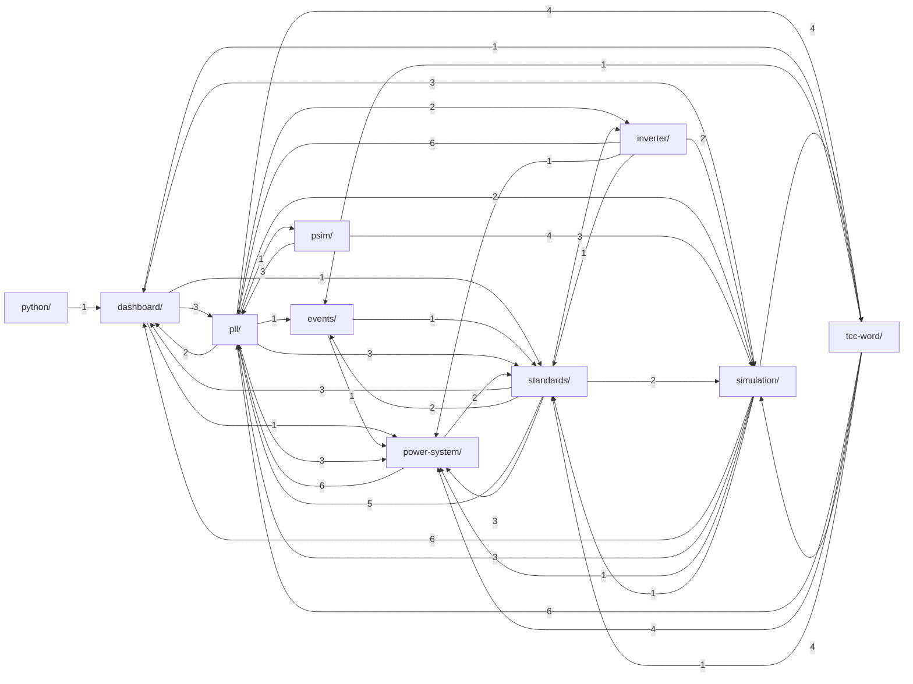

# KB — grafo de relações entre pastas

Voltar: [índice do KB](index.md)

<!-- kb-links:begin -->

Número na seta = quantos docs da origem apontam para docs do destino.
Grafo arquivo a arquivo: Graph View do Obsidian (vault = `.claude/`).
<!-- kb-links:end -->
