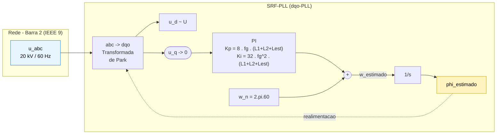
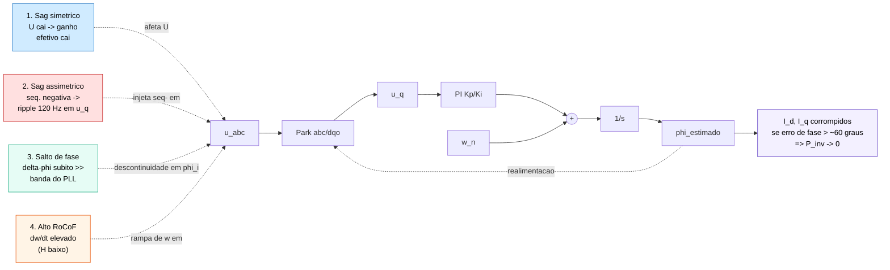
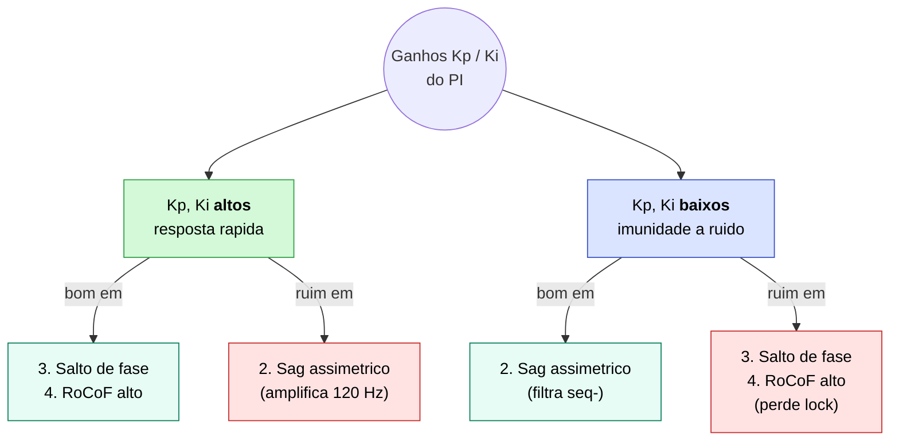

# Comportamento do SRF-PLL de Inversores Frente a Contingências em Sistemas Elétricos

<p align="center">
  
</p>

<p align="center">
  
  
  
  
</p>

**TCC — Engenharia Elétrica (Sistemas de Potência)**
UERJ — Faculdade de Engenharia | 2025
Autores: Bruno Henrique de Oliveira & Victor Hugo de Avelar Rezende
Orientador: Prof. Dr. Oscar Cuaresma Zevallos | Coorientador: Prof. Dr. Andre Guilherme Peixoto Alves

---

## Motivacao

A perturbacao de **15 de agosto de 2023** no Sistema Interligado Nacional (SIN) resultou no desligamento de **22.547 MW** — cerca de 31% da carga nacional. O Relatorio de Analise de Perturbacao (RAP) do ONS concluiu que o desempenho dos equipamentos de controle de usinas eolicas e fotovoltaicas ficou **aquem do previsto nos modelos matematicos**.

Este trabalho investiga o algoritmo **SRF-PLL** (Synchronous Reference Frame Phase-Locked Loop) como possivel causa central dessa falha, analisando seu comportamento dinamico frente a contingencias severas na rede eletrica.

---

## Objetivo

Analisar o desempenho dinamico e a robustez do SRF-PLL de inversores conectados a rede frente a um espectro de contingencias eletricas, avaliando os impactos sobre o rastreamento de fase, a injecao de potencia e a conformidade com requisitos de LVRT.

---

## Sistema Modelado

### Topologia

- **Inversor:** VSI (Voltage Source Inverter) trifasico de dois niveis
- **Filtro de acoplamento:** LCL (Indutor-Capacitor-Indutor)
- **Rede:** Sistema IEEE de 9 barras (base 20 kV / 100 MVA, 60 Hz)

### Parametros do Filtro LCL

| Parametro | Descricao |
|---|---|
| `L1` | Indutor do lado do inversor |
| `L2` | Indutor do lado da rede |
| `Cf` | Capacitor do filtro |
| `omega_res` | Frequencia de ressonancia: 9068,99 rad/s |
| `xi` | Fator de amortecimento: 0,707 |
| `fs` | Frequencia de chaveamento: 5 kHz |

### SRF-PLL

1. **Detector de Fase** — baseado na componente dq da tensao no PAC
2. **Filtro de Loop** — controlador PI (ganhos `Kp` e `Ki`)
3. **VCO** — Oscilador Controlado por Tensao

### Controle de Corrente

- Referencial sincrono dq — controle desacoplado de P e Q
- Sintonia por cancelamento de polo e zero
- Transformadas de Clarke (αβ) e Park (dq)

---

## Arquitetura do SRF-PLL

> Diagramas em Mermaid (renderizados nativamente pelo GitHub). Fontes editaveis em [`assets/diagrams/`](assets/diagrams/).

### 1. Estrutura do laco com os ganhos do projeto

Detector de fase = transformada de Park; quando `u_q -> 0`, entao `phi_estimado -> phi_real` e `u_d -> U`. Malha de **tipo 2** (integrador no PI + integrador do VCO) → rastreia degraus de frequencia com erro nulo em regime.



**Modelo linear:** `s² + Kp.U.s + Ki.U = 0` → polos por `2.xi.wn` e `wn²/U`.

### 2. Como cada contingencia ataca o laco



### 3. Trade-off central de Kp / Ki (Secao 4.3)



---

## Sistema de 9 Barras

A rede eletrica e representada pelo classico **sistema IEEE de 9 barras**, com 3 geradores sincronos, 3 transformadores e 6 linhas de transmissao.

### Geradores

| Gerador | MVA | kV | xd (pu) | xd' (pu) | xq (pu) |
|---|---|---|---|---|---|
| G1 | 247,5 | 16,5 | 0,1460 | 0,0608 | 0,0969 |
| G2 | 192,0 | 18,0 | 0,8958 | 0,1198 | 0,8645 |
| G3 | 128,0 | 13,8 | 1,3125 | 0,1813 | 1,2578 |

### Impedancia de Thevenin

A impedancia equivalente de Thevenin vista pelo inversor na barra de conexao e calculada a partir do elemento diagonal da **matriz de impedancia nodal (Zbarra)**:

```
Zbarra = inv(Ybarra)
Z_th = Z_ii  (barra de conexao do inversor)
```

Esse valor e usado como parametro de rede no dimensionamento do filtro e no projeto do controlador.

---

## Cenarios de Contingencia

| Cenario | Descricao |
|---|---|
| Afundamento simetrico | Falta trifasica — reducao de amplitude sem sequencia negativa |
| Afundamento assimetrico | Introduz sequencia negativa — gera oscilacoes de 2a harmonica no PLL |
| Salto de fase (Phase-Angle Jump) | Mudanca abrupta de fase — pode causar perda de sincronismo |
| Alta RoCoF | Elevada taxa de variacao de frequencia — desafio ao rastreamento |

---

## Metricas de Desempenho

- **IAE** — Integral do Erro Absoluto do angulo de fase
- **ISE** — Integral do Erro Quadratico do angulo de fase
- **Tempo de acomodacao** do erro de fase
- Oscilacoes de potencia ativa e reativa durante a contingencia
- Conformidade com **LVRT** (IEEE 1547-2018)

---

## Metodologia

1. **Modelagem da rede** — montagem da Ybarra/Zbarra e calculo da impedancia de Thevenin
2. **Dimensionamento do filtro LCL** — calculo de L1, L2, Cf e resistores de amortecimento
3. **Projeto dos controladores** — ganhos Kp e Ki do PLL e do controlador de corrente
4. **Simulacao EMT** — execucao dos cenarios de contingencia no Simulink
5. **Analise de resultados** — IAE, ISE, tempo de acomodacao e conformidade LVRT

---

## Conteudo do Repositorio

| Arquivo | Descricao |
|---|---|
| `pll_stability_9bus_analysis.ipynb` | Calculo analitico: Ybarra/Zbarra, Thevenin, filtro LCL e ganhos do controlador |
| `pll_stability_9bus.slx` | Modelo Simulink do inversor grid-tied com SRF-PLL no sistema de 9 barras |

---

## Ferramentas

- **MATLAB/Simulink** — simulacao EMT e analise de sistemas de controle
- **PSIM** — eletronica de potencia, harmonicos e transitorios
- **Python / Jupyter** — calculo analitico de parametros

---

## Referencias

- YAZDANI, A.; IRAVANI, R. *Voltage-Sourced Converters in Power Systems*. Wiley, 2010.
- TEODORESCU, R.; LISERRE, M.; RODRIGUEZ, P. *Grid Converters for Photovoltaic and Wind Power Systems*. Wiley, 2011.
- BOLLEN, M. H. J. *Understanding Power Quality Problems*. IEEE Press, 2000.
- IEEE Std 1547-2018 — *Interconnection and Interoperability of Distributed Energy Resources*
- ONS — *Relatorio de Analise de Perturbacao (RAP) — 15/08/2023*
