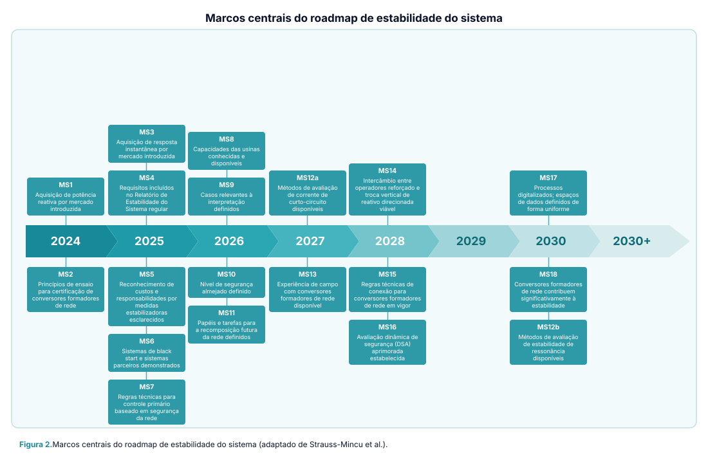
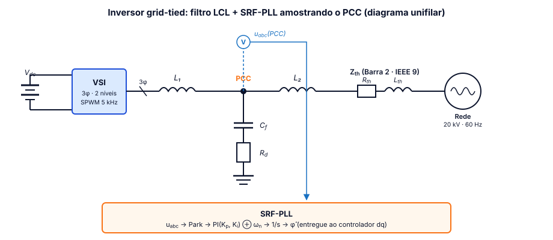
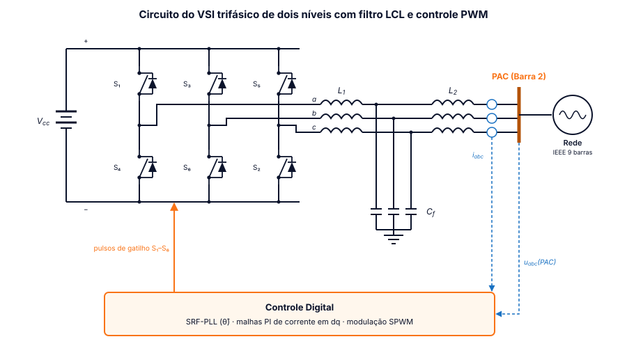
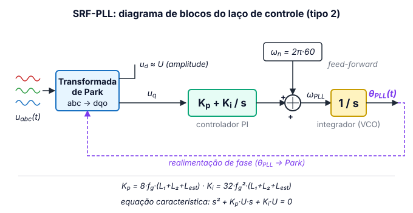
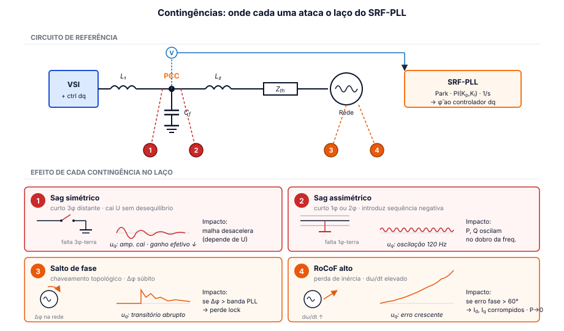
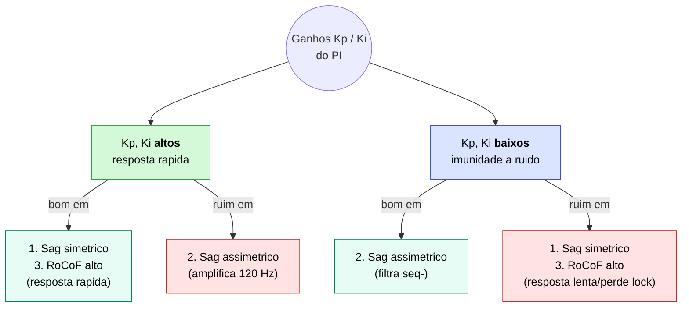
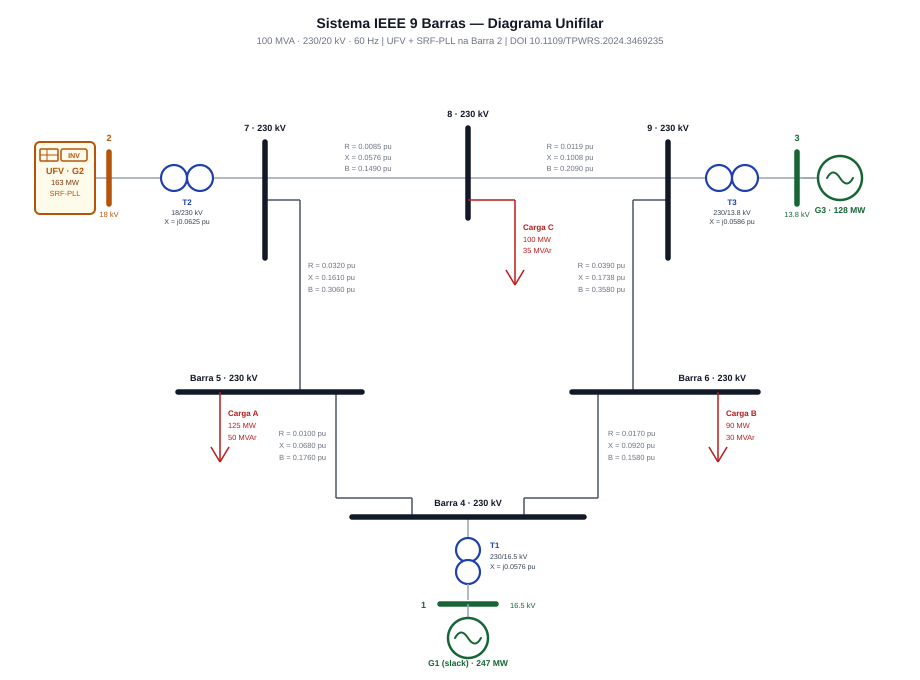
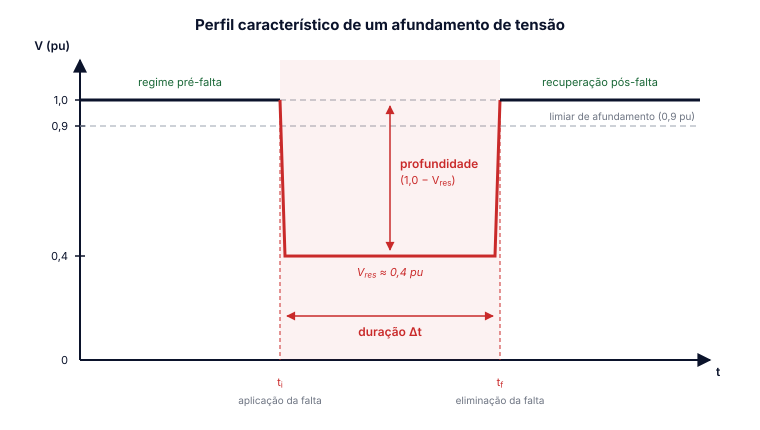
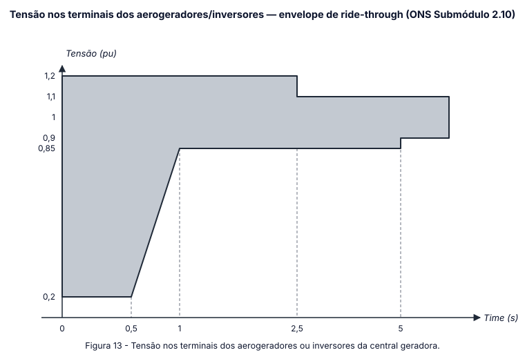
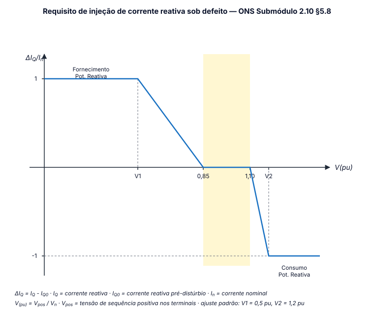

# Comportamento do SRF-PLL de Inversores Frente a Contingências em Sistemas Elétricos

<p align="center">
  
</p>

<p align="center">
  
  
  
  
  
  
</p>

**TCC — Engenharia Elétrica (Sistemas de Potência)**
UERJ — Faculdade de Engenharia | 2025
Autores: Bruno Henrique de Oliveira & Victor Hugo de Avelar Rezende
Orientador: Prof. Dr. Oscar Cuaresma Zevallos | Coorientador: Prof. Dr. Andre Guilherme Peixoto Alves

---

## Motivacao

A perturbacao de **15 de agosto de 2023** no Sistema Interligado Nacional (SIN) resultou no desligamento de **23.368 MW** — cerca de 34,5% da carga do SIN. O Relatorio de Analise de Perturbacao (RAP) do ONS concluiu que o desempenho dos equipamentos de controle de usinas eolicas e fotovoltaicas ficou **aquem do previsto nos modelos matematicos**.

Este trabalho investiga o algoritmo **SRF-PLL** (Synchronous Reference Frame Phase-Locked Loop) como possivel causa central dessa falha, analisando seu comportamento dinamico frente a contingencias severas na rede eletrica.

### Contexto: transicao para redes dominadas por inversores

O apagao de 2023 nao e um caso isolado — Iberia (abr/2025) e Chile (fev/2025) tiveram
eventos de origem semelhante, ligados a redes com alta penetracao de recursos baseados
em inversor (IBR). O roadmap alemao de estabilidade (Strauss-Mincu et al.) situa esse
tipo de falha dinamica na transicao 2024-2030+ rumo a sistemas dominados por eletronica
de potencia.

<p align="center">
  
</p>

---

## Objetivo

Analisar o desempenho dinamico e a robustez do SRF-PLL de inversores conectados a rede frente a um espectro de contingencias eletricas, avaliando os impactos sobre o rastreamento de fase, a injecao de potencia e a conformidade com requisitos de LVRT.

---

## Sistema Modelado

### Topologia

- **Inversor:** VSI (Voltage Source Inverter) trifasico de dois niveis
- **Filtro de acoplamento:** LCL (Indutor-Capacitor-Indutor)
- **Rede:** Sistema IEEE de 9 barras (base 20 kV / 100 MVA, 60 Hz)

### Parametros do Filtro LCL

| Parametro | Descricao |
|---|---|
| `L1` | Indutor do lado do inversor |
| `L2` | Indutor do lado da rede |
| `Cf` | Capacitor do filtro |
| `omega_res` | Frequencia de ressonancia: 9068,99 rad/s |
| `xi` | Fator de amortecimento: 0,707 |
| `fs` | Frequencia de chaveamento: 5 kHz |

### SRF-PLL

1. **Detector de Fase** — baseado na componente dq da tensao no PAC
2. **Filtro de Loop** — controlador PI (ganhos `Kp` e `Ki`)
3. **VCO** — Oscilador Controlado por Tensao

### Controle de Corrente

- Referencial sincrono dq — controle desacoplado de P e Q
- Sintonia por cancelamento de polo e zero
- Transformadas de Clarke (αβ) e Park (dq)

---

## Arquitetura do SRF-PLL

> Diagramas com simbologia de circuito (LCL, fonte CA, Z_th) e de controle (somador, integrador, FT do PI). Fontes editaveis em [`assets/diagrams/`](assets/diagrams/).

### 1. Circuito do inversor grid-tied com sondagem do PCC

VSI alimenta o filtro **LCL** (L1-Cf+Rd-L2), que se conecta a rede pela impedancia de Thevenin `Z_th` da Barra 2. O SRF-PLL amostra a tensao trifasica do PCC e devolve a fase estimada `phi_chapeu` ao controlador dq.

<p align="center">
  
</p>

### 2. Sistema completo: potencia + controle digital (Figura 3.1 do TCC)

Versao detalhada do mesmo sistema: VSI trifasico de dois niveis (IGBTs + diodos), filtro LCL com TCs/TP de medicao, e a cadeia de controle digital completa — SRF-PLL, bloco Submodulo 2.10 (`ONS_2_11`) gerando `id_ref`/`iq_ref`, PIs de corrente em dq e PWM.

<p align="center">
  
</p>

### 3. Diagrama de blocos do laco SRF-PLL

Detector de fase = transformada de Park; quando `u_q -> 0`, entao `phi_chapeu -> phi_real` e `u_d -> U`. Malha de **tipo 2** (integrador no PI + integrador do VCO) → rastreia degraus de frequencia com erro nulo em regime.

<p align="center">
  
</p>

### 4. Onde cada contingencia ataca o laco

Marcadores no circuito de referencia indicam o ponto de injecao de cada falta; os paineis abaixo mostram o efeito qualitativo em `u_q` e o impacto no controle.

<p align="center">
  
</p>

### 5. Trade-off central de Kp / Ki (Secao 4.3)


```mermaid
flowchart TB
    Centro(("Ganhos Kp / Ki<br/>do PI"))
    Alto["Kp, Ki <b>altos</b><br/>resposta rapida"]:::a
    Baixo["Kp, Ki <b>baixos</b><br/>imunidade a ruido"]:::b

    Centro --> Alto
    Centro --> Baixo

    Alto -- "bom em" --> R1["1. Sag simetrico<br/>3. RoCoF alto<br/>(resposta rapida)"]:::good
    Alto -- "ruim em" --> R2["2. Sag assimetrico<br/>(amplifica 120 Hz)"]:::bad
    Baixo -- "bom em" --> R3["2. Sag assimetrico<br/>(filtra seq-)"]:::good
    Baixo -- "ruim em" --> R4["1. Sag simetrico<br/>3. RoCoF alto<br/>(resposta lenta/perde lock)"]:::bad

    classDef a fill:#d3f9d8,stroke:#2f9e44,color:#000
    classDef b fill:#dbe4ff,stroke:#364fc7,color:#000
    classDef good fill:#e6fcf5,stroke:#087f5b,color:#000
    classDef bad  fill:#ffe3e3,stroke:#c92a2a,color:#000
```

---

## Sistema de 9 Barras

A rede eletrica e representada pelo classico **sistema IEEE de 9 barras**, com 3 geradores sincronos, 3 transformadores e 6 linhas de transmissao. G2 (Barra 2) e substituido pelo inversor grid-following modelado neste trabalho.

<p align="center">
  
</p>

### Geradores

| Gerador | MVA | kV | xd (pu) | xd' (pu) | xq (pu) |
|---|---|---|---|---|---|
| G1 | 247,5 | 16,5 | 0,1460 | 0,0608 | 0,0969 |
| G2 | 192,0 | 18,0 | 0,8958 | 0,1198 | 0,8645 |
| G3 | 128,0 | 13,8 | 1,3125 | 0,1813 | 1,2578 |

### Impedancia de Thevenin

A impedancia equivalente de Thevenin vista pelo inversor na barra de conexao e calculada a partir do elemento diagonal da **matriz de impedancia nodal (Zbarra)**:

```
Zbarra = inv(Ybarra)
Z_th = Z_ii  (barra de conexao do inversor)
```

Esse valor e usado como parametro de rede no dimensionamento do filtro e no projeto do controlador.

---

## Cenarios de Contingencia

| Cenario | Descricao |
|---|---|
| Afundamento simetrico | Falta trifasica — reducao de amplitude sem sequencia negativa |
| Afundamento assimetrico | Introduz sequencia negativa — gera oscilacoes de 2a harmonica no PLL |
| Alto RoCoF | Baixa inercia sistemica (G1/G3) eleva dw/dt pos-falta — desafia a largura de banda do PI do PLL |

> Salto de fase (phase-angle jump) foi avaliado na literatura mas **descartado por
> instrucao do orientador** — nao sera implementado no modelo.

<p align="center">
  
</p>

---

## Requisitos Normativos de Suporte a Rede (ONS / IEEE 1547)

Durante a contingencia, o inversor deve permanecer conectado (LVRT) e injetar corrente
reativa de suporte — a norma brasileira (ONS Submodulo 2.10, funcao `ONS_2_11` no
modelo) e a norte-americana (IEEE 1547-2018) definem curvas equivalentes de tensao×tempo
e tensao×corrente reativa.

<p align="center">
  
</p>

<p align="center">
  
</p>

A conformidade normativa, porem, **depende do PLL manter o angulo estimado correto**:
se o referencial dq esta corrompido por perda de lock, a corrente reativa e injetada na
direcao errada mesmo que a logica de suporte esteja ativa — ver
[`ons_2_11.md`](.claude/kb/standards/ons_2_11.md).

---

## Metricas de Desempenho

- **IAE** — Integral do Erro Absoluto do angulo de fase
- **ISE** — Integral do Erro Quadratico do angulo de fase
- **Tempo de acomodacao** do erro de fase
- Oscilacoes de potencia ativa e reativa durante a contingencia
- Conformidade com **LVRT** (IEEE 1547-2018)

---

## Metodologia

1. **Modelagem da rede** — montagem da Ybarra/Zbarra e calculo da impedancia de Thevenin
2. **Dimensionamento do filtro LCL** — calculo de L1, L2, Cf e resistores de amortecimento
3. **Projeto dos controladores** — ganhos Kp e Ki do PLL e do controlador de corrente
4. **Simulacao EMT** — execucao dos cenarios de contingencia no Simulink
5. **Exportacao** — `scripts/export_sim_data.m` converte `logsout` em CSV
6. **Analise de resultados** — `app.py` calcula IAE, ISE, ts, ΔP, ΔQ e gera relatorio HTML interativo

## Pipeline de Analise

```
MATLAB/Simulink          Python (src/)
──────────────           ─────────────────────────────────────
params.m                 SimData      → lê CSV, calcula métricas
   ↓                     ChartBuilder → subplots Plotly multi-painel
simular .slx             HTMLRenderer → HTML com toggle light/dark
   ↓
export_sim_data.m  →  output/sim_data.csv  →  app.py  →  output/pll_metrics.html
```

```powershell
# Gerar relatorio apos simular e exportar CSV:
.venv\Scripts\python.exe app.py
# Saida: output/pll_metrics.html (abrir no navegador)
```

---

## Achados Recentes dos Testes

- A inercia das maquinas sincronas **G1 e G3** passou a ser variavel critica na analise.
- Foram testados diferentes valores de segundos de inercia com reatancia de curto entre
  **2% e 20%** do valor base de **529 ohms**.
- No modelo atual, valores de inercia acima de aproximadamente **0,1 s** evitaram o
  colapso total observado nos casos de baixissima inercia.
- O colapso aparece principalmente na recuperacao pos-contingencia: o PLL tenta voltar
  ao sincronismo, entra em oscilacao/loop de erro e perde sua funcao de referencia.
- Quando o PLL perde a referencia angular, `Id` e `Iq` deixam de seguir trajetorias
  coerentes e a injecao de potencia do inversor se torna desorganizada.
- Tentativas de notch/filtros para reduzir componentes de **120 Hz** em curtos
  assimetricos nao resolveram os casos severos de baixa inercia; o filtro segue util
  para ripple de sequencia negativa, mas nao substitui uma solucao para lock-loss.

---

## Conteudo do Repositorio

| Caminho | Descricao |
|---|---|
| `pll_stability_9bus.slx` | Modelo Simulink principal — inversor grid-tied com SRF-PLL no sistema de 9 barras |
| `params.m` | Parametros MATLAB: rodar no Command Window antes de simular |
| `app.py` | Entry point Python — gera `output/pll_metrics.html` a partir do CSV |
| `src/` | Pacote Python: `SimData`, `ChartBuilder`, `HTMLRenderer`, `config` |
| `requirements.txt` | Dependencias Python: numpy, pandas, plotly |
| `scripts/export_sim_data.m` | Exporta `logsout_IEEE9BusLoadflow` → `output/sim_data.csv` |
| `scripts/analyze_sim_data.py` | Script legado de analise (substituido por `app.py`) |
| `notebooks/pll_stability_9bus_analysis.ipynb` | Calculo analitico: Ybarra/Zbarra, Thevenin, filtro LCL e ganhos |
| `output/` | Gerado em runtime: `sim_data.csv` (MATLAB) e `pll_metrics.html` (Python) |
| `simulink/pll_stability_9bus_FaultModel.slx` | Subsistema de falta para estudos auxiliares |
| `simulink/GridTiedInverterOptimalI2.slx` | Modelo de referencia MathWorks com seus parametros |
| `simulink/teste_isolado.slx` | Sandbox para testes isolados |
| `simulink/archive/` | Backup do modelo antes das modificacoes |
| `assets/` | Diagramas SVG, banner e figuras do README |

---

## Ferramentas

- **MATLAB/Simulink** — simulacao EMT e analise de sistemas de controle
- **PSIM** — eletronica de potencia, harmonicos e transitorios
- **Python 3.11+ / Jupyter** — calculo analitico de parametros e pipeline de analise pos-simulacao
- **Plotly** — relatorio HTML interativo com graficos multi-painel e toggle light/dark

---

## Referencias

- YAZDANI, A.; IRAVANI, R. *Voltage-Sourced Converters in Power Systems: Modeling, Control, and Applications*. Wiley-IEEE Press, 2010.
- KARIMI-GHARTEMANI, M. *Enhanced Phase-Locked Loop Structures for Power and Energy Applications*. Wiley-IEEE Press, 2014.
- ANDERSON, P. M.; FOUAD, A. A. *Power System Control and Stability*. 2. ed. IEEE Press / Wiley-Interscience, 2003.
- GU, Y.; GREEN, T. C. Power System Stability With a High Penetration of Inverter-Based Resources. *Proceedings of the IEEE*, v. 111, n. 7, p. 832-853, jul. 2023.
- ALVES, A. G. P. *Metodologia para Auto-Ajuste de Controladores de Corrente em Conversores Fonte de Tensão Conectados a Redes Sujeitas a Distúrbios Harmônicos*. Tese (Doutorado) — COPPE/UFRJ, 2022.
- IEEE Std 1547.2-2023 — *Application Guide for IEEE Std 1547-2018, Interconnection and Interoperability of Distributed Energy Resources*
- IEEE Std 519-2014 — *Recommended Practice and Requirements for Harmonic Control in Electric Power Systems*
- ONS — *Procedimentos de Rede, Submódulo 2.10 — Requisitos técnicos mínimos para a conexão às instalações de transmissão*, rev. 2025.02
- ONS — *RAP-ONS 00012/2023 — Relatório de Análise da Perturbação do dia 15/08/2023 às 08h30min*
- ENTSO-E — *Grid Incident in Spain and Portugal on 28 April 2025 — Final Report*, mar. 2026
- COORDINADOR ELÉCTRICO NACIONAL (Chile) — *Estudio para Análisis de Falla del 25 de febrero de 2025 (EAF 089/2025)*, 2025
- IEA — *Global Energy Review 2026*

Lista completa e citações por seção: [`.claude/kb/`](.claude/kb/) (cada arquivo carrega `source:`/`references:` no frontmatter).
